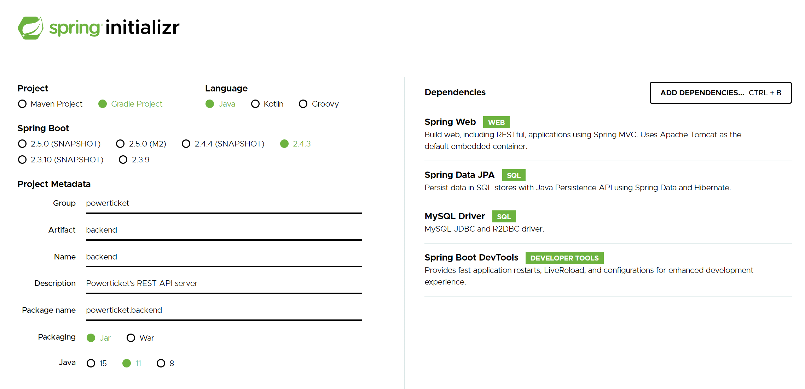
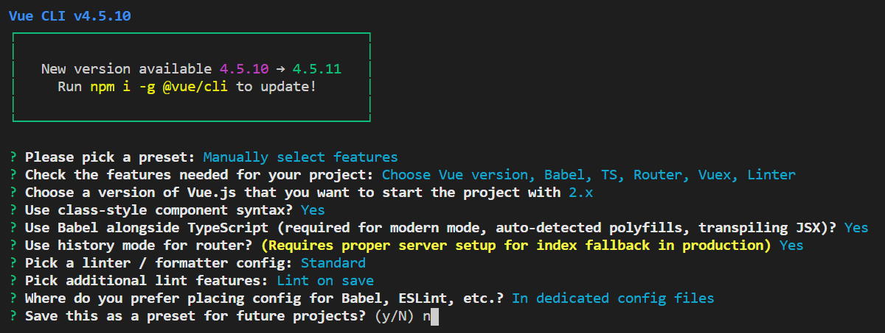

# ticket-boilerplate

같이 사용하는 빈도가 높은 프레임워크를 하나의 패키지로 관리하기 위한 초기 스타터입니다. Docker Compose를 통해 하나의 네트워크로 묶어 배포하는 것을 목표로 합니다.


## Spring Boot




## Vue.js




## MySQL

`docker run --name spring-mysql -p 3306:3306 -e MYSQL_ROOT_PASSWORD=mymysql -d mysql`

`CREATE USER 'username'@'localhost' IDENTIFIED BY 'password';`

`GRANT ALL ON test.* TO 'username'@'localhost';`

```mysql
CREATE TABLE member
(
	id INT NOT NULL AUTO_INCREMENT PRIMARY KEY,
	name VARCHAR(30)
);
INSERT INTO member(name) VALUES("test1");
INSERT INTO member(name) VALUES("test2");
SELECT * FROM member;
```

