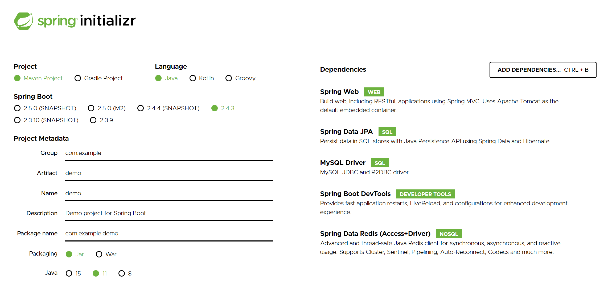
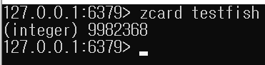
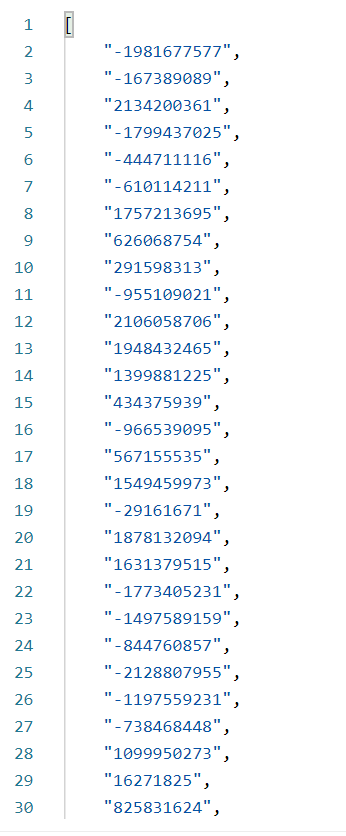

# Spring-MySQL-Redis

## Spring




## Docker Compose

```dockerfile
version: '3'

services:
  database:
    container_name: project-mysql
    image: mysql
    environment:
      MYSQL_PASSWORD: spring
      MYSQL_ROOT_PASSWORD: mysql
      MYSQL_USER: spring
      MYSQL_DATABASE: test
    ports:
      - '3306:3306'
  cache:
    container_name: project-redis
    image: redis
    ports:
      - '6379:6379'
```


### [POST] localhost:8080/redis/



랜덤 데이터 1000만개 생성(시간 다소 소요됨)


### [GET] localhost:8080/ranking/



랭킹 ID 조회